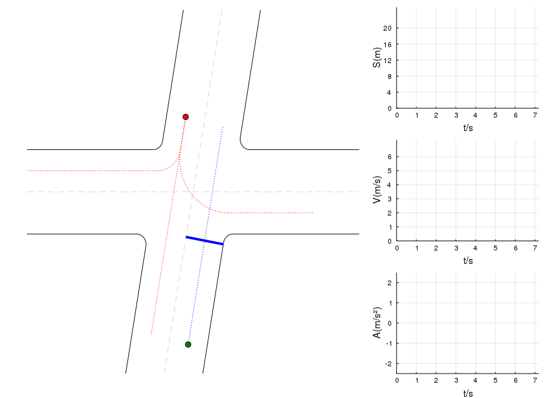
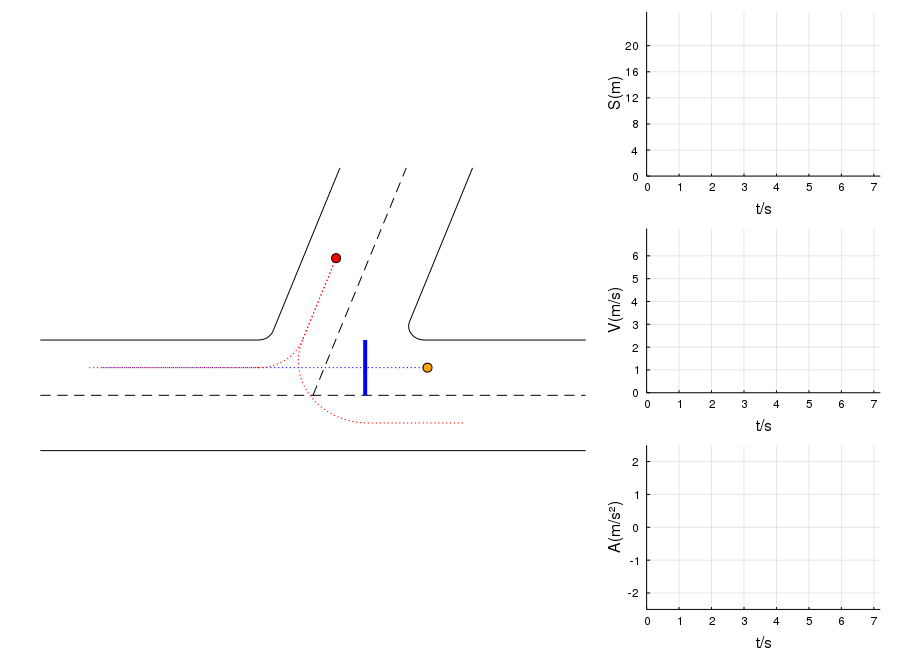
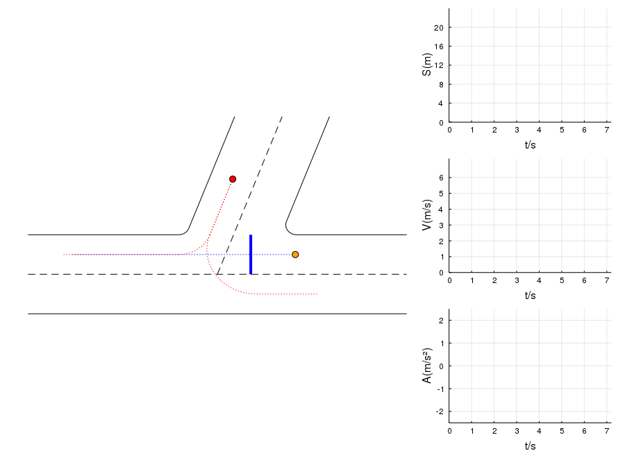

# Decision-Making based on [POMDP](https://en.wikipedia.org/wiki/Partially_observable_Markov_decision_process) and [IDM](https://en.wikipedia.org/wiki/Intelligent_driver_model) Model 
### Installation:  
- In Julia-REPL, add this package and build:
```julia
using Pkg
Pkg.add(PackageSpec(url = "https://github.com/mexsser/POMDPIDMModel.jl"))
Pkg.build("POMDPIDMModel")
```
### Run Test
- in Julia-REPL, type
```julia
Pkg.test("POMDPIDMModel")
```
- or test explicitly
```julia
import POMDPIDMModel
cd(joinpath(dirname(pathof(POMDPIDMModel)), "..", "test"))
include("runtests.jl")
```
- Or you can simply type the following command in terminal after changing directory to **POMDPIDMModel/test/**
```bash
$ julia --color=yes -i -O -- runtests.jl
```
### Dependencies:
- Julia v1.0.1  
- ffmpeg
- python
- matplotlib
- [sympy](https://github.com/sympy/sympy)
- qt5-default
#

#

#

