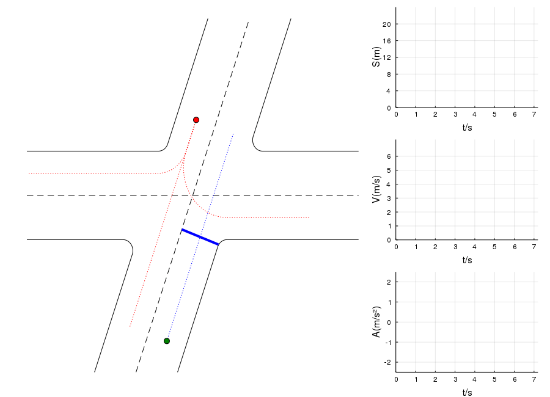
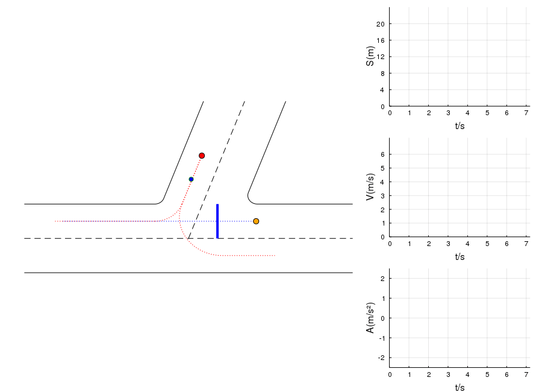
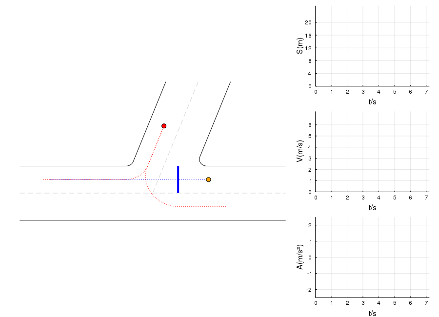

# Decision-Making based on [POMDP](https://en.wikipedia.org/wiki/Partially_observable_Markov_decision_process) and [IDM](https://en.wikipedia.org/wiki/Intelligent_driver_model) Model.
### Preparation:  
- Please run [**INSTALL.jl**](./INSTALL.jl) once to install the needed julia packages.  
- In Julia-REPL mode, press key "**]**" to enter Pkg mode, add and activate this package:
```julia
(v1.0) pkg> add https://github.com/mexsser/POMDPIDMModel.jl
(v1.0) pkg> activate .
(v1.0) pkg> instantiate
```
### Run Test
- in Julia-REPL mode, press key "**;**" to enter shell mode, change directory to **POMDPIDMModel/test/**, then go back to REPL and type
```julia
julia> include("runtests.jl")
```
- Or you can simply type the following command in terminal after changing directory to **POMDPIDMModel/test/**
```bash
$ julia --color=yes -i -O -- runtests.jl
```
### Dependencies:
- Julia v1.0  
- ffmpeg
- python
- matplotlib
#

#

#

